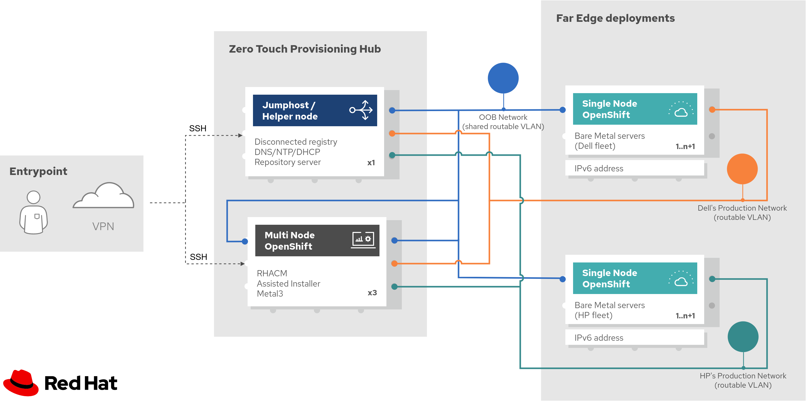

# Network requirements

> **Note:** Given that most of the network requirements to deploy an OpenShift cluster can be found in the [Official Red Hat Documentation](https://docs.openshift.com/container-platform/4.10/installing/installing_bare_metal_ipi/ipi-install-prerequisites.html#network-requirements_ipi-install-prerequisites), we have focused this section on those requirements which are missing, or can be further automated for Telco deployments.

## Brief Overview

The following diagram presents a high-level schematic of the networks required in a generic Telco environment. Please note that, we have maintained the same nomenclature used by the Red Hat documentation, namely **provisioning**, **baremetal**, and **Out of Band (OOB)** networks.

In Telco scenarios, the **provisioning** network is usually not used, and hence a `virtualmedia` BMC address (via `redfish`, `idrac`, etc.) is required to provision not only the initial cluster on the ZTP Hub, but also all the SNO clusters at the Far Edge locations.

> **Note:** Since Telco scenarios usually provision their clusters via BMC, then layer-2 connectivity is not needed (required only by PXE booting) to deploy their clusters. Instead, **routed VLANs with a careful layer-3 subnetting** would be enough to segment the different traffics at deployment times.

In terms of VLANs, we have introduced two main groups, namely _"Shared routable OOB VLAN"_, and _"Routable Production VLAN"_. Description of the two defined VLANs, as well as the networks that it carries, is presented below.

- _"OOB Network" a shared and routable VLAN:_ As expected, this VLAN carries all the traffic from the **OOB network**. On one hand, it is a shared VLAN because it provides access to all the BMCs that will host an OpenShift deployment (either in the ZTP Hub, and Far Edge locations). On the other hand, since different subnets might be configured over this shared VLAN (e.g. to separate the ZTP Hub traffic from the Far Edge deployments), it needs to be routable among all those.

    - _OOB subnet for the ZTP Hub:_ This can be an IPv4 and/or IPv6 network with static IPs addresses assigned to BMCs at the ZTP Hub. This subnet is used by the Bastion to deploy the initial Multi Node OpenShift cluster.

    - _OOB subnets for the Far Edge deployments:_ This can be IPv4 and/or IPv6 networks with static IPs addresses assigned to BMCs located at the Far Edge deployments. These subnets are used by the Multi Node OpenShift cluster to deploy the target SNOs at the Far Edge locations.

- _"Baremetal Network" a routable VLAN:_ This VLAN groups the **baremetal** network defined on the Red Hat’s documentation. In Telco deployments, these networks can be used by different “functional” groups (e.g. per diverse teams, per environments like production and development, or per fleets of specific hardware manufacturers). For the sake of simplicity, in above image, we have only denoted two different VLANs, grouping a number of n servers from Dell and HP, respectively.

    - _Baremetal subnet:_ This is usually an IPv6 network. It is a routable subnet because it enables every target SNO deployment at the Far Edge to reach the required services (e.g. disconnected registry, repository server, etc.) running on the Bastion node.
    - _Provisioning subnet:_ It is not used in this deployment.

> **Note:** In above image, as an example, we have denoted two VLANs grouping target SNO deployments on a per-hardware basis. However, production-grade environments for Telcos can group the SNO servers in VLANs based on specific current conditions (e.g. geographical distribution, fiber allocations, etc.) on their deployments.

## Requirement description

Following an [OSI model](https://en.wikipedia.org/wiki/OSI_model) approach, network requirements in this section were organized on a per-layer basis. Each layer corresponds to a phase of required configurations to be enforced either on the nodes hosting the ZTP Hub cluster, and/or in the access switch that provides connectivity services along the Data Center (DC).

### 2.1) Layer 2 Phase

#### 2.1.1) Configure Virtual Local Area Networks ([VLANs](https://en.wikipedia.org/wiki/Virtual_LAN))

- _Description:_ **Configuring VLANs applies to switch ports and the Bastion and Hub cluster nodes.** For this deployment, VLANs are mainly used to isolate (at the layer-2) the traffic coming from the different broadcast domains in the Telco environments.

- _Table of Configurations:_ Below we provide a table resuming where and how the VLAN configurations should be applied.

- _Automation:_ Usually, this task is performed manually using specific commands via the CLI interface of the available networking equipment.

#### 2.1.2) Disable Spanning Tree Protocol ([STP](https://en.wikipedia.org/wiki/Spanning_Tree_Protocol))

- _Description:_ **Disabling STP applies to switch ports where the Hub cluster nodes are connected.** Usually, network admins configure STP to avoid layer-2 loops in their network topologies. However, when deploying the initial Hub cluster this configuration may conflict with the DHCP configured on that VLAN. As an alternative, `portfast` could be enabled on the host facing ports.

- _Table of Configurations:_ Below we provide a table resuming where this config should be applied.

- _Automation:_ Usually, this task is performed manually using specific commands via the CLI interface of the available networking equipment.

### 2.2) Layer 3 Phase

#### 2.2.1) Configure network interface

- _Description:_ This is simply the creation of the network interface on the Bastion node connected to the baremetal network.

- _Automation:_ A sample playbook to automate the configuration of the network interface can be found on `automation/network-requirements.yml`[L14-L47](../automation/network-requirements.yml#L14-L47).

#### 2.2.2) Configure [RaDVD](https://en.wikipedia.org/wiki/Radvd) and [SLAAC](https://www.networkacademy.io/ccna/ipv6/stateless-address-autoconfiguration-slaac)

- _Description:_ In Linux systems, IPv6 uses NA, ND, RA packets to manage the members in the network. Using RaDVD, RAs work faster and more reliably than using `dnsmasq`. Additionally, it has more flexibility with the timeouts and the desired RA’s behaviour. By contrast, the ND and NA packets will be managed by the routing equipment (disabled on `dnsmasq`). We have also disabled SLAAC in the bastion node.

- _Automation:_ A sample playbook to automate the configuration of RaDVD can be found on `automation/network-requirements.yml`[L49-L65](../automation/network-requirements.yml#L49-L65). As a validation, two pre-flight checks could be automated here.

  - To check RA's that include the managed flag.
  - To check for valid IPv6 gateways via RAs and ensure not multiple ones.

#### 2.2.3) Configure DNS, DHCP, and NTP

> **Note:** For more info about the setup of the [DNS, DHCP](https://docs.openshift.com/container-platform/4.10/installing/installing_bare_metal_ipi/ipi-install-prerequisites.html#network-requirements_ipi-install-prerequisites), and [NTP](https://docs.openshift.com/container-platform/4.10/installing/installing_bare_metal_ipi/ipi-install-installation-workflow.html#configuring-ntp-for-disconnected-clusters_ipi-install-configuration-files) servers, you may check the provided links to the official documentation of Red Hat.

- _Description:_ These services should be running on the bastion node serving local clients on the **baremetal** networks. The corresponding subsections can be found below:

    - Configuring the DNS server
    - Dynamic Host Configuration Protocol (DHCP) requirements
    - Network Time Protocol (NTP)

- _Automation:_ A sample playbook to automate the installation and configuration of the DNS, DHCP services (via `dnsmasq`), and the NTP services on the Bastion node can be found on `automation/services-requirements.yml`[L67-L143](../automation/network-requirements.yml#L67-L143). As you can see, we have divided this ansible block into two tasks, one for the NTP service using chrony [L68-L84](../automation/network-requirements.yml#L68-L84), and another for the DNS and DHCP services using dnsmasq [L115-L141](https://github.com/leo8a/ztp-hub-automation/blob/main/automation/network-requirements.yml#L115-L141).

### 2.3) Layer 4 Phase (optional)

Additionally, two optional components that are gaining more traction on Telco deployments are the use of an external proxy and an external load balancer.

#### 2.3.1) External Proxy

#### 2.3.2) External Load Balancer
